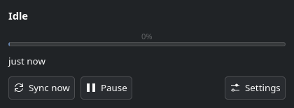

# Nimbus

Google Drive sync for Linux. A Rust daemon runs `rclone bisync` on a schedule
and when files change. A GTK4 tray client shows the state and takes commands
over D-Bus.



The daemon owns the sync. It watches the local folder, keeps an interval, and
serves one D-Bus interface. The tray owns the interface to the user. It shows
the phase, the progress, the time since the last run, and the last error. It
starts with no daemon and waits for one.

## Requirements

Three floors, all of them real:

| Floor | Version | Why |
| --- | --- | --- |
| Rust | 1.92 | The `gtk4` bindings declare it. The daemon alone needs 1.87, from `zbus`. |
| GTK | 4.10 | The build enables the `v4_10` feature. |
| rclone | 1.71 | rclone 1.71 promoted `bisync` from beta to stable. Before that the command does not exist in this form. |

The build needs the GTK4 development package. The runtime needs `rclone`.

| Distribution | GTK4 | rclone | Builds |
| --- | --- | --- | --- |
| Arch Linux | `gtk4` 4.22.5 | `rclone` 1.75.1 | yes |
| Fedora 44 | `gtk4-devel` 4.22.5 | `rclone` 1.74.3 | yes |
| Debian 13 | `libgtk-4-dev` 4.18.6 | see below | yes |
| Debian 12 | `libgtk-4-dev` 4.8.3 | see below | no, GTK is below 4.10 |

Debian ships rclone 1.60.1, which predates stable `bisync`. Install a newer
rclone from the rclone apt repository or from a static build before the first
run.

```console
# Debian, after adding the rclone apt repository
sudo apt install libgtk-4-dev rclone
```

## Build

```console
git clone https://github.com/LuckJMG/Nimbus
cd Nimbus
cargo build --release
```

## Install

The `justfile` holds the recipe, and it is the only copy of the file list.

```console
just install            # into /usr, needs root
just install-user       # into your home directory, needs no root
```

Read the `justfile` for what each recipe installs and where. `install-user`
rewrites the absolute paths in the unit and the service file, so read the paths
it prints. A home directory install also needs an icon cache rebuild, which the
Troubleshooting section covers.

The two programs start in two different ways. The daemon runs as a systemd user
unit, because it needs no display and because a restart policy matters. The tray
starts from the autostart entry, because the login session owns `WAYLAND_DISPLAY`
and a systemd user unit does not. The autostart entry takes effect at the next
login. The entry passes `--hidden`, so a login starts the tray icon and no
window. A start from the app menu opens the window. `just run-tray` starts the tray now instead, and it finds the installed
binary after either install.

## Configure

Give rclone a Google Drive remote first. The name below is `drive`, which is
also the default.

```console
rclone config
```

The daemon reads one file. It writes the file with the default settings on the
first start, so start the daemon once, then edit the file and start it again.
The Settings dialog of the tray writes the same file while the daemon runs.

```
~/.config/nimbus/config.toml
```

| Key | Default | Meaning |
| --- | --- | --- |
| `remote` | `drive` | The rclone remote name. The name comes from your rclone config. The daemon syncs the root of it, written `drive:/`. |
| `local` | `~/Cloud` | The local folder. The daemon watches this folder. |
| `paused` | `false` | A run that is active finishes. Later runs wait for a resume. |
| `interval_secs` | `900` | The longest gap between two runs, counted from the end of the last run. |
| `debounce_secs` | `30` | The quiet time after the last file change. |
| `resync_pending` | `true` | The next run uses the rclone flag `--resync`, after you confirm it. The flag clears only after a run that ends without an error. |
| `extra_flags` | `[]` | More rclone flags for every run, for example `["--drive-skip-shortcuts", "--drive-acknowledge-abuse"]`. |

The daemon syncs the root of the remote, so the whole drive is the target. A
build before this one read a `path` key and synced one folder inside the remote.
The daemon now refuses a config file that still carries `path` and prints the
line to delete, so an upgrade never moves to a different set of files by
accident.

The daemon also keeps its record of your files in `bisync/`, beside the config file.
Do not delete that directory while the daemon runs. A lost connection leaves the
record unusable, and the daemon restores it before the next run.

A run starts when any one of these is true:

- The last file change is at least `debounce_secs` old.
- The last run finished at least `interval_secs` ago.
- You asked for a run with Sync now.
- No run has ever finished.

The daemon watches only the local folder. A change that arrives from another
machine waits for the next interval.

A lost connection does not need a manual fix. The daemon keeps a record of what
both sides agreed on, and it restores that record before the next run, so the retry
stays incremental. Only a crash that left no record at all needs a full resync.

A resync compares every file on both sides. Where a file differs, the local
copy replaces the remote copy. So the daemon never runs one on its own. The
window says "A resync is needed" and shows a Resync button, and the resync
starts after you confirm it. The first run of a new config is a resync too.

## Use

The tray icon sits in the panel. A left click opens the window. A right click
opens the menu. On Wayland, a left click brings the window to the front only when
the window is closed. A window that is already open keeps its place, because the
compositor refuses a raise without a click of its own. The taskbar entry flashes
instead.

| Item | What it does |
| --- | --- |
| The first row | The phase and the last error. The row is not a command. |
| Sync now | Starts a run. The call returns before the run finishes. |
| Pause | Skips later runs. A run that is active finishes first. |
| Settings | Opens the dialog for the keys in the table above. |
| Quit | Stops the tray. The daemon keeps running. |

The Settings row opens a dialog for `remote`, `local`, `interval_secs`,
`debounce_secs`, and `extra_flags`. The dialog takes the flags as one line,
separated by spaces. The daemon takes the new keys at once and writes the file.
A time above 86400 needs the file, because the dialog stops at one day.

The Open config file button opens the file in the editor that the desktop
picks for it. Stop the daemon before you edit the file. A running daemon does
not read the file again, and it writes the file on every pause, so a later
pause overwrites your edit. Use the Start daemon button in the window after the
edit.

A moved `remote` or `local` has no bisync listing, so the next run is a full
resync. The dialog asks before the save, and the "Save and resync" button
confirms the resync.

## The D-Bus API

Any client can read the state and send the same commands.

| | |
| --- | --- |
| Bus name | `io.github.luckjmg.nimbus` |
| Object path | `/io/github/luckjmg/nimbus` |
| Interface | `io.github.luckjmg.nimbus1` |
| Property | `State`, signature `(sdts)` |
| Methods | `SyncNow`, `SetPaused(b)`, `GetSettings`, `SetSettings(ssttas)`, `Resync` |
| Signal | `Changed(State)` |

The four values of the signature are the phase as a string, the progress as a
double, the time of the last finished run as a Unix timestamp, and the last
error as a string. The phase is one of `idle`, `syncing`, `paused`, `error`, or
`resync`. In `resync`, the daemon waits until a client calls `Resync`. A
`SetSettings` call that moves the remote or the folder also confirms it.
The progress runs from 0.0 to 1.0 and is zero while the daemon is idle.

```console
busctl --user get-property io.github.luckjmg.nimbus /io/github/luckjmg/nimbus io.github.luckjmg.nimbus1 State
busctl --user call io.github.luckjmg.nimbus /io/github/luckjmg/nimbus io.github.luckjmg.nimbus1 SyncNow
busctl --user call io.github.luckjmg.nimbus /io/github/luckjmg/nimbus io.github.luckjmg.nimbus1 SetPaused b true
busctl --user call io.github.luckjmg.nimbus /io/github/luckjmg/nimbus io.github.luckjmg.nimbus1 SetPaused b false
busctl --user call io.github.luckjmg.nimbus /io/github/luckjmg/nimbus io.github.luckjmg.nimbus1 GetSettings
busctl --user call io.github.luckjmg.nimbus /io/github/luckjmg/nimbus io.github.luckjmg.nimbus1 SetSettings ssttas drive '~/Cloud' 900 30 0
```

The values of `ssttas` are `remote`, `local`, `interval_secs`,
`debounce_secs`, and `extra_flags`. The `0` sends an empty list of flags. A refusal names the problem, for example:

```console
Call failed: The remote is empty. Set it to an rclone remote name, for example drive.
```

`busctl --user monitor` does not filter by name. Watch the signal with:

```console
dbus-monitor --session "type='signal',interface='io.github.luckjmg.nimbus1'"
```

If you write a client in Rust, set `cache_properties(CacheProperties::No)` on
the proxy. A proxy caches properties and refreshes the cache only on the
standard `PropertiesChanged` signal, which the daemon does not send. A cached
proxy reports a stale state forever.

## Troubleshooting

**The tray says "The daemon is not running".** The unit is not running. Run
`systemctl --user status nimbusd.service` and read `journalctl --user -u
nimbusd.service`. A bad config makes the daemon stop on purpose, so the unit
shows as inactive rather than restarting. The window shows the reason below
the heading, and a Start daemon button starts the unit again. The daemon also shows the reason as a desktop notification titled
"Nimbus did not start". If Do Not Disturb is on,
the notification is in the notification history.

**The daemon says "another daemon already holds io.github.luckjmg.nimbus".**
Two daemons are running. Only one can own the name. Stop the other one, then
start this one again. A second daemon exits with zero, because only you can free
the name.

**rclone says "Bisync aborted. Must run --resync to recover."** A lost connection
left rclone without a usable record of your files. The daemon repairs this by
itself before the next run, so the retry is incremental and no action is needed.

If nothing survives to restore, the window says "A resync is needed". Press
Resync and confirm. The cost is one full pass over both sides.

A failed run waits for `interval_secs` before it retries, because there is no
separate retry timer. Set `interval_secs` to something like `300` if the connection
is often down, so a blip costs you five minutes instead of fifteen.

**The first run fails on a test remote.** The destination folder must exist
before the first run. Google Drive creates folders, so this affects test
remotes only. A remote of the type `alias` with an absolute path is the only
test remote that resolves the same way from any working directory.

**The tray shows a blank icon.** A host looks an icon name up in its own cache,
and the cache does not know an icon that was installed after the last rebuild.
Nimbus sends the installed directory in `IconThemePath`, so the host can find the
theme. Some hosts still need their own cache rebuilt:

```console
gtk4-update-icon-cache -f -t ~/.local/share/icons/hicolor
kiconcache6 -f ~/.local/share/icons        # KDE, the tool is called kiconcache5 on older releases
```

A package install into `/usr/share/icons` normally needs neither command, because
the distribution builds the cache for that directory. A `just install-user`
install into your home directory is the case that needs one.

## Uninstall

`just uninstall` removes the files that `just install` added, and it needs root.
`just uninstall-user` removes the files that `just install-user` added, and it
needs no root.

```console
sudo just uninstall
just uninstall-user
```

The config file and the rclone remote stay, because both hold settings that you
wrote. Remove `~/.config/nimbus/` by hand if you want them gone. That directory
holds the config file and the `bisync/` record, so a fresh install starts with no
record and rebuilds it on the first run.

## Development

```console
cargo fmt --all --check
cargo clippy --workspace --all-targets -- -D warnings
cargo test --workspace
```

No CI runs these three. Run all of them before every commit, in that order.
`just check` runs the same three.

The unit tests do not cover the bus, the watcher, the panel, or rclone. Those
need a live run, and `AGENTS.md` holds the procedure together with the traps
that a live run found. That file also holds the crash test for the listing repair,
which no unit test can cover.

`just sandbox` builds both binaries and runs them against a local folder that
stands in for the remote, so a run never reaches Google Drive. The recipe stops
while a daemon already holds the bus name, because one daemon owns
`io.github.luckjmg.nimbus` in a session. `just sandbox-stop` ends the daemon
that the recipe started.

| Crate | Role |
| --- | --- |
| `nimbus-ipc` | The D-Bus contract. Names, `State`, `Phase`, one proxy trait. No logic. |
| `nimbusd` | The daemon. Library plus binary. |
| `nimbus` | The tray. One binary: the window, the icon, and the menu. |

## License

MIT. See [LICENSE](LICENSE).
